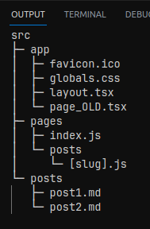
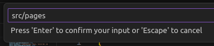

<a href="https://marketplace.visualstudio.com/items?itemName=jake-demian.project-hierarchy-explorer" style="display: none;">
  <picture>
    <source media="(prefers-color-scheme: dark)" srcset="https://raw.githubusercontent.com/jakedemian/project-hierarchy-explorer/main/images/icon.png" width="140">
    <source media="(prefers-color-scheme: light)" srcset="https://raw.githubusercontent.com/jakedemian/project-hierarchy-explorer/main/images/icon.png" width="140">
    
  </picture>
</a>

# Project Hierarchy Explorer

[](https://marketplace.visualstudio.com/items?itemName=jake-demian.project-hierarchy-explorer)&nbsp;
[](https://github.com/jakedemian/project-hierarchy-explorer/blob/main/LICENSE.md)&nbsp;
[](https://GitHub.com/jakedemian/project-hierarchy-explorer/stargazers/)&nbsp;
[](https://github.com/jakedemian/project-hierarchy-explorer/actions/workflows/checks.yml)&nbsp;
&nbsp;


Project Hierarchy Explorer provides commands that output a text version of your open project's hierarchy. You can output to either a file or the output console depending on your [configuration](#configuration-options). Easily share and discuss your project structure with other contributors, or give it to your favorite AI for greatly improved clarity in your prompts.


## Features

- Generate a full project hierarchy that includes all files and directories, excluding those specified in the `ignorePatterns` configuration
- Generate a subtree hierarchy of just the directory you care about.
- Commands can be run as [Tasks](#running-commands-as-tasks)
- Output is generated in a tree-like format, providing a clear view of the project's structure that can easily be copy/pasted.

## Usage

1. Open the command palette with `Ctrl+Shift+P` (or `F1`)
2. Search for and run the [Command](#commands) that you want


3. View the output file at the root of your project, or check the console output (depending on your [configuration](#configuration-options)).



## Commands

### **Generate** -> _`project-hierarchy-explorer.generate`_:

- Generates a hierarchy for your entire project starting at the root of the project.

### **Generate Subtree** -> _`project-hierarchy-explorer.generateSubtree`_:

- After selecting this command you will be prompted to enter the relative path to the directory you wish to use as root for this generation. See the below example for more details.

  <details>
    <summary>Example</summary>

  Imagine we have a project with the following structure:

  ```
  src
  ├─ app
  │  ├─ favicon.ico
  │  ├─ globals.css
  │  └─ layout.tsx
  ├─ pages
  │  ├─ index.js
  │  └─ posts
  │     └─ [slug].js
  └─ posts
    ├─ post1.md
    └─ post2.md
  ```

  We wish to only display the hierarchy of the `pages` directory. We could use the `Generate Subtree` command to achieve this. Run the command, and in the prompt window enter `src/pages`

  

  and the resulting output in this example would be:

  ```
  pages
  ├─ index.js
  └─ posts
    └─ [slug].js
  ```

  </details>

## Configuration Options

All configurations are prepended with `project-hierarchy-explorer`, for example:

```
project-hierarchy-explorer.ignorePatterns
```

### Configurations

- ### `ignorePatterns`

  The `ignorePatterns` setting can be added to your workspace or user settings to ignore specific files or directories when generating the project hierarchy. It uses the glob pattern syntax.

  For example:

  ```json
  "project-hierarchy-explorer.ignorePatterns": [".git", "node_modules", "*.js.map"]
  ```

  This will ignore any .git directories and node_modules directories when generating the project hierarchy.

- ### `outputsTo`

  Represents where you would like to output the project hierarchy to.

  Valid values are: `'file'` (default), `'console'`, and `'both'`

- ### `suppressNotification`

  The `suppressNotification` setting is useful when generating the project hierarchy in a build pipeline or as a task.

  ```json
  "project-hierarchy-explorer.suppressNotification": true
  ```

  This will prevent the notification from appearing after the project hierarchy is generated.

## Running Commands As Tasks

To run the Generate command as a task create a `.vscode/tasks.json`:

```json
{
  "version": "2.0.0",
  "tasks": [
    {
      "label": "Generate Project Hierarchy",
      "type": "shell",
      "command": "${input:generateProjectHierarchy}",
      "problemMatcher": []
    }
  ],
  "inputs": [
    {
      "id": "generateProjectHierarchy",
      "type": "command",
      "command": "project-hierarchy-explorer.generate"
    }
  ]
}
```

This can be very powerful when used for validation with something like ChatGPT.

### Note:

If you plan to run the `Generate Subtree` command as a task, you will need to supply the `relativePath` parameter in your `tasks.json` instead of relying on the input popup. Use the below example as a reference:

<details>
<summary>Example</summary>

```json
// .vscode/tasks.json

{
  "version": "2.0.0",
  "tasks": [
    {
      "label": "Generate Subtree Project Hierarchy",
      "type": "shell",
      "command": "${input:generateSubtreeProjectHierarchy}",
      "problemMatcher": []
    }
  ],
  "inputs": [
    {
      "id": "generateSubtreeProjectHierarchy",
      "type": "command",
      "command": "project-hierarchy-explorer.generateSubtree",
      "args": ["src/utils"]
    }
  ]
}
```

</details>
<br/>

## Contribute

https://github.com/jakedemian/project-hierarchy-explorer

## License

### MIT

This project uses the MIT License. Please review the [MIT License](LICENSE.md) for details.
