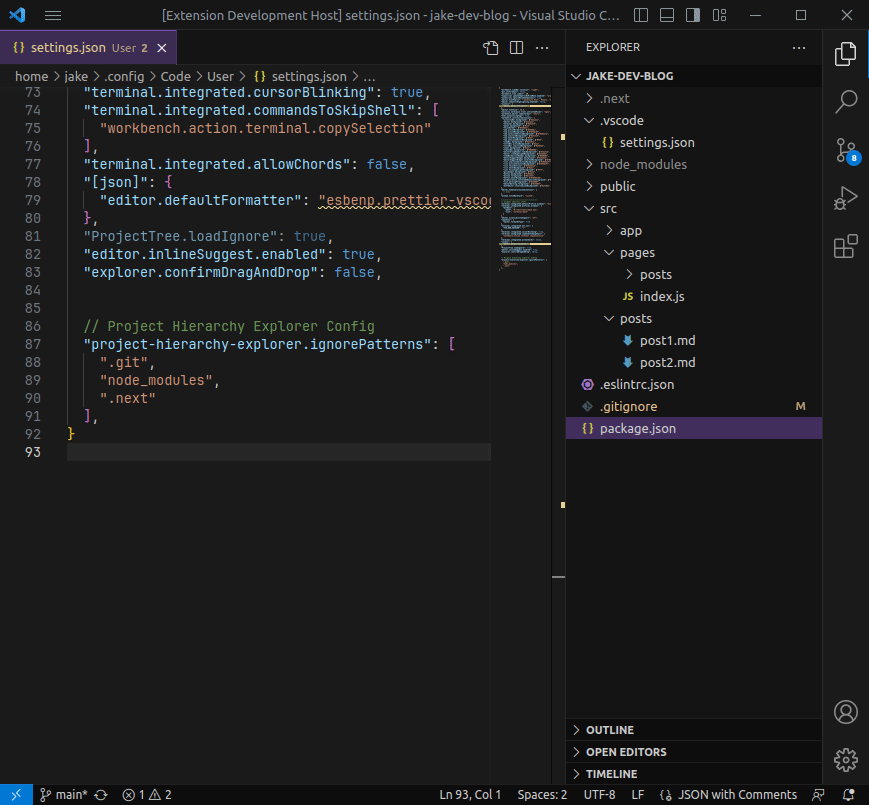
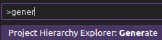
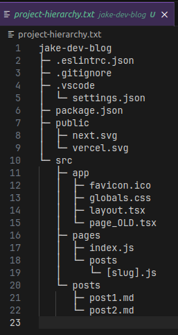

# Project Hierarchy Explorer

Project Hierarchy Explorer is a Visual Studio Code extension that generates a hierarchy of your project, and outputs it into a file called `project-hierarchy.txt` located at the root of your project.



## Features

- Generates a project hierarchy that includes all files and directories, excluding those specified in the `ignorePatterns` setting.
- The hierarchy is generated in a tree-like structure, providing a clear view of the project's structure.

## Usage

1. Open the command palette with `Ctrl+Shift+P` (or `F1`)
2. Search for and run `Project Hierarchy Explorer: Generate`



3. A notification will appear upon successful generation of the hierarchy, and you can view the `project-hierarchy.txt` file at the root of your project.




## Configuration Options

### Config key

All configurations are prepended with `project-hierarchy-explorer`, for example:

```
project-hierarchy-explorer.ignorePatterns
```

### `ignorePatterns`

The `ignorePatterns` setting can be added to your workspace or user settings to ignore specific files or directories when generating the project hierarchy. It uses the glob pattern syntax.

For example:

```json
"project-hierarchy-explorer.ignorePatterns": [".git", "node_modules", "*.js.map"]
```

This will ignore any .git directories and node_modules directories when generating the project hierarchy.

### `suppress-notification`

The `suppress-notification` setting is useful when generating the project hierarchy in a build pipeline or as a task.

```json
"project-hierarchy-explorer.suppressNotification": true
```

This will prevent the notification from appearing after the project hierarchy is generated.

## Run As Task

To run the Generate command as a task create a `.vscode/tasks.json`:
```json
{
    "version": "2.0.0",
    "tasks": [
        {
            "label": "Generate Project Hierarchy",
            "type": "shell",
            "command": "${input:generateProjectHierarchy}", 
            "problemMatcher": []
        }
    ],
    "inputs": [
        {
            "id": "generateProjectHierarchy",
            "type": "command",
            "command": "project-hierarchy-explorer.generate"
        }
    ]
}
```
This can be very powerful when used for validation with something like chatGpt.

## Contribute

https://github.com/jakedemian/project-hierarchy-explorer

## License

### MIT

This project uses the MIT License. Please review the [MIT License](LICENSE.md) for details.
